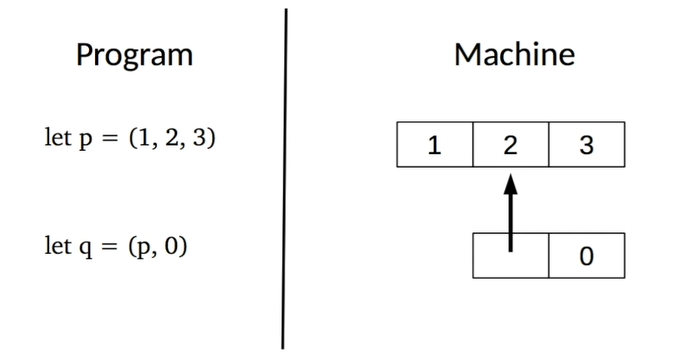

# Basic Data Structures
Организация кода с помощью данных и типов.

Домашка на этой неделе — простая БД на типах.

## User Defined Types
Через определение собственных типов на основе уже имеющихся в языке удобно смоделировать предметную область:

> Types are useful to document a program because _they attach an application-specific meaning to a set of values_. A _type abbreviation_ is the simplest way to introduce types in programs by binding a user-defined identifier to a type.

Пример — дни недели. Если мы хотим обозначить день недели цифрой от 0 до 6 (пн, вт, ...), то мы можем указать, что день — это целое число не меньше нуля и не больше шести. Типа так:

```
day is 0 <= x <= 6
Using type `day` in function:
is_week_day : day -> bool
```

Syntax to Declare a Type:

```ocaml
(* Abbreviation or Synonym for `some_type`. Must start with lower case. *)
type some_type_identifier = some_type;;

(* Syntax error! A type identifier must start with a lowercase letter. *)
type A = int;;

(* Annotate identifier with type
   to constrain the expression: *)
let x : some_type = some_expression;;

(* Annotate function argument *)
let f (x : some_type) = some_expression;;

(* To constrain return type of a function
   put the type annotation just before `=` without parentheses *)
let f x : some_type = some_expression;;
let f (x : some_type) : some_other_type = some_expression;;

(* Constrain the type of an expression: *)
let f x = (some_expression : some_type)
```

Аннотации типов не влияют на выполнение программы. Если есть такое:

```ocaml
type t = int;; (* `t` is a type alias for built-in `int` type *)
let x : t = some_expression;;
```

То `x` будет типом `int`, потому что `t` — это аннотация для `int`. Тип `t` в ЭВМ представлен как тип `int`.

## Constructing and Observing Tuples
Можно формировать тип-кортеж (tuple type) с помощью оператора `*` (type constructor):

```ocaml
(* type some_type = some_other_type * ... * some_other_type;; *)
type point2D = int * int;;

(* Construct a tuple *)
let origin : point2D = (0, 0);;
```

### Pattern Matching
Работа с любыми составными данными в OCaml основана на паттерн-матчинге.

> Patterns describe how values are observed by the program.

Паттерны используются в `let`-байндингах и аргументах функций.

Идентификаторы — тоже простая форма паттерна:

```ocaml
let x = 6 * 3 in x;; (* I observe the value of `6*3` by naming it `x` *)

(* Ignore the value with wildcard pattern: *)
let _ = 6 * 3 in 1;; (* I ignore the value of `6 * 3` *)

(* In a Tuple: *)
let (x, _) = (6 * 3, 2) in x;; (* I observe the first component
                                  of `(6 * 3, 2)` by naming it `x`.
                                  Also I ignore the second component. *)
```

В ЭВМ кортеж представлен как heap allocated block (в памяти есть блок с ячейками для каждого компонента пары):



Идентификатор (`p`  или `q`) содержит указатель на этот блок (пример с `q`, где первый элемент — указатель на другой кортеж). В кортеже `let q = (p, p);;` оба `p` будут указывать на один и тот же блок в памяти.

### Structural Equality VS Physical Equality
- `=` — structure equality operator: два значения эквивалентны, если их содержимое одинаково (`2 = 2`).
- `==` — physical equality operator: два значения эквивалентны, если они хранятся в одинаковом месте в памяти (два указателя равны физически).

### Pattern Pitfalls
Типичные ошибки при паттерн-матчинге (ловятся компилятором):

- Нужно соблюдать арность в паттерне и в соответствующей структуре данных.
- Идентификаторы в паттерне должны быть разные (non-linear patterns).

```ocaml
(* Errors: *)
let (x, _) = (1, 2, 3);;
let (x, x, y) = (1, 2, 3);;
```

Позиционированные идентификаторы могут вести к семантическим ошибкам. С помощью типа `Record` можно использовать доступ по ключу.

## Records
В кортежах важна позиция элементов при создании и при обращении к ним. В записях (records) каждая позиция именована, порядок элементов не важен, это хэш-мап.

General syntax to define record type:

```ocaml
type some_type_identifier = { field_name : field_type; ... }

(* Example: *)
type point2D = { x : int; y : int };;
```

При объявлении своего типа на основе Record рекомендуют названия полей (`field_name`) делать разными. Так компилятор сможет лучше выводить типы.

Чтобы создать значение объявленного типа на основе Record, вместо `:` используется `=`:

```ocaml
some_record = { field_name = <some_expression>; ... }

(* Example: *)
let origin = { x = 0; y = 0 };;
```

Observe a field of the record (получить значение поля из записи):

```ocaml
some_expression.field_name
```

В ЭВМ записи — это heap-allocated block, как и tuple.

## Arrays
Массив — динамическая структура данных. Используется, когда не ясно, сколько элементов в составной структуре будет при компиляции.

Все элементы массива должны быть одного типа (в Tuple и Record типы элементов могут быть разными).

Модуль `Array` предоставляет функции для манипуляции массивами.

Когда предварительный размер массива известен, для объявления можно использовать литеральный синтаксис:

```ocaml
let p = [| 1; 2; 3 |];;
```

Когда элементы неизвестны или надо объявить сразу большой массив, то есть функция `Array.make size val`, принимающая размер желаемого массива и значение, которое запишется в каждый элемент.

Есть ещё `Array.init size fn`, которая создаст массив из `n` элементов и к каждому применит функцию `fn` от текущего индекса.

`Array.length arr` вернёт размер массива.

Элемент по индексу: `my_arr.(3)`.

Чтобы достать несколько элементов массива, можно юзать паттерн `[| p1, p2, ... |]`. **Но!** Размер массива должен быть таким же, как и паттер. И ещё не учитывается возможность передавать пустой массив. Поэтому **паттерн-матчинг для массивов — такое себе дело**. Но возможность есть.

В ЭВМ Array is a heap-allocated block.

Попытка достать элемент через отрицательный индекс или индекс больше, чем `Array.length - 1` приведёт к ошибке.

## Case Study: a Small Typed Database
Создать контакт-лист, в котором можно:

- добавлять
- удалять
- искать контакты


